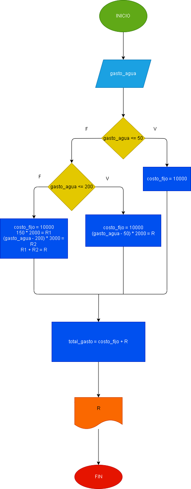

# calcular el gasto de agua de una vivienda dado el numero de m3 gastados 

## siendo el sistema de cobro el siguiente:

1. cuota fija mensual: 10000
2. primeros 50 m3 gratis
3. entre 50 y 200 m3 se cobra el m3 a 2000
4. apartir de 200 m3 se cobra el m3 a 3000

